# **WinnerWinner**帮助文档
## 简介
**WinnerWinner** 程序主要的功能是对屏幕指定区域进行截屏，然后调用百度OCR API 进行识别然后使用百度搜索。对**百万英雄**，**冲顶大会**等答题APP起辅助作用。
## 准备工作
### 获取百度API KEY
既然使用到百度的OCR API，那么首先就要获取百度的API KEY，主要步骤如下：
1. 访问[百度AI开放平台](http://ai.baidu.com/)，选择控制台->文字识别
    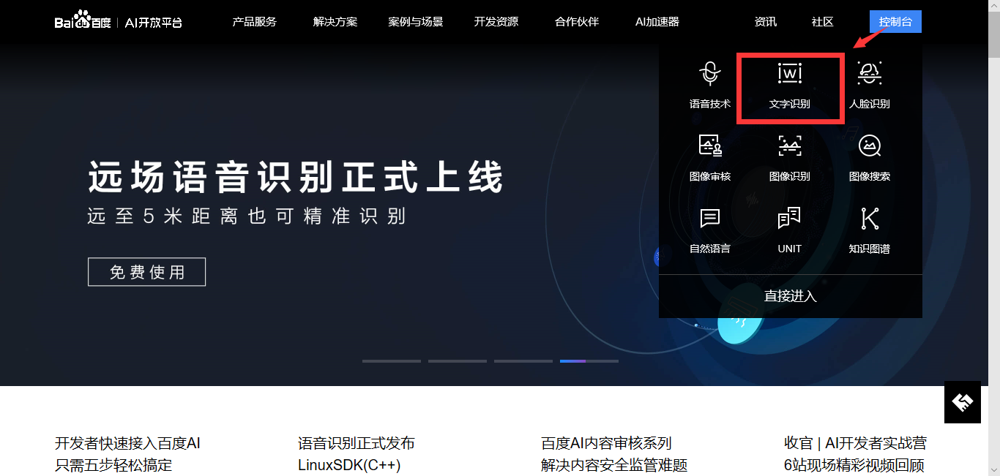
2. 使用百度账号登陆
3. 选择创建应用，在创建应用页面中填写相关信息，接口选择必须要选择文字识别相关的接口
    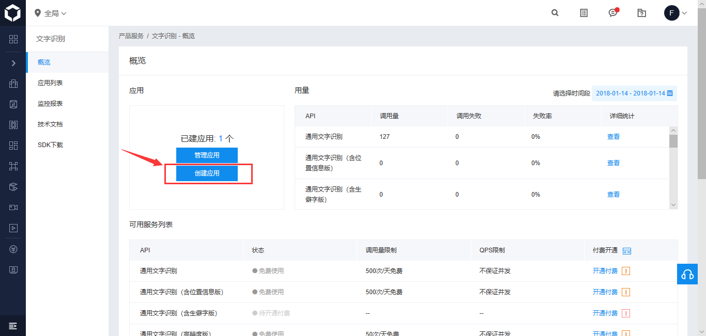
    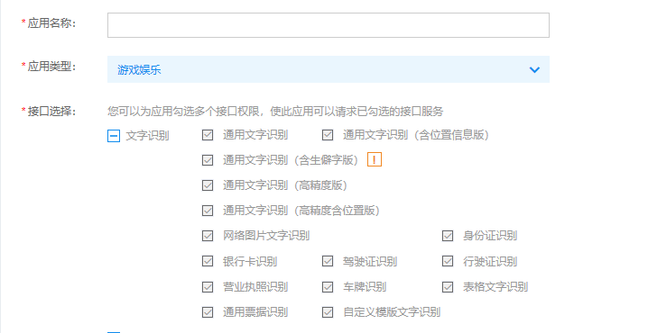
4. 然后到应用列表中，就可以看到刚刚生成的应用，可以看到 API Key 和 Secret Key，这两个 Key 在后面的应用中会用到
    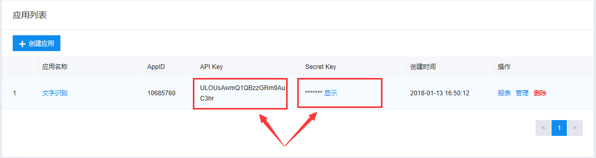

### 投屏准备
1. 选择一个投屏程序，在我测试中选择的时 Screen 投屏
2. 打开手机的 USB 调试功能
3. 将投屏窗口放在无窗口阻挡处
    正确放置：
    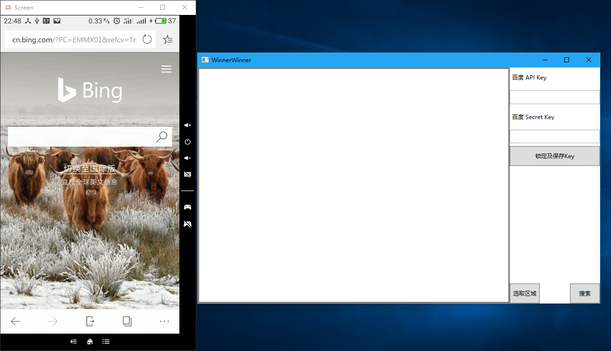
    错误放置：
    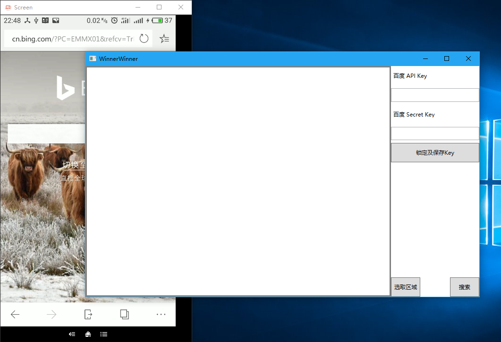

## 开始使用
1. 打开 **WinnerWinner** 主程序，将之前注册的百度 Key 填入相应位置中
    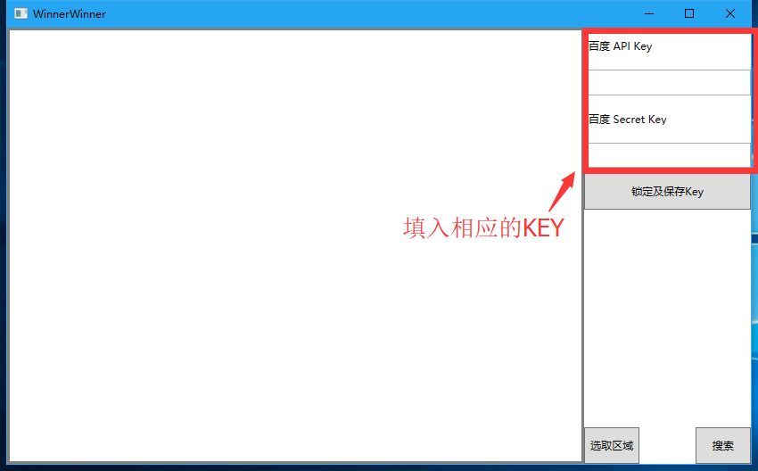
2. 选择截图区域，用法跟QQ截图基本类似，选定了区域之后就会对该区域进行截图
    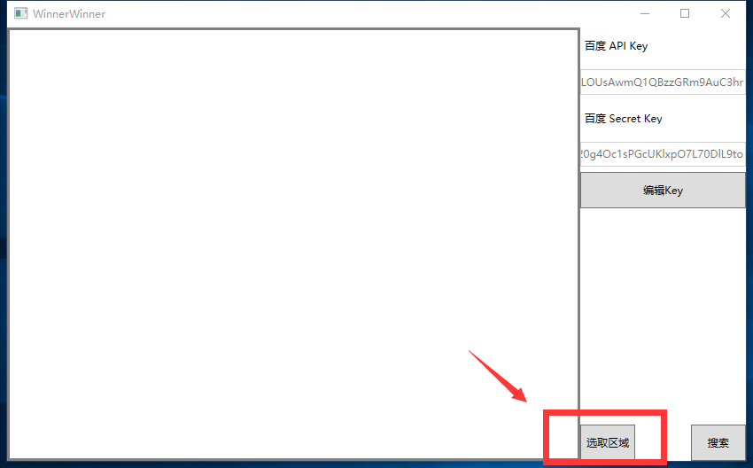
3. 然后点击**搜索**大功告成

## 使用头脑王者测试
1. 输入百度KEY，如果点击**锁定并保存Key**的话，下次打开程序会自动填写Key
    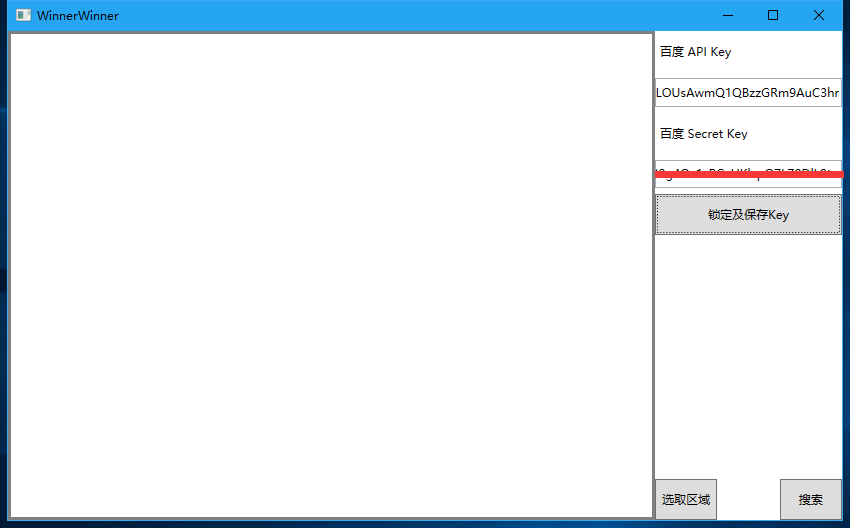
1. 选择截图区域
    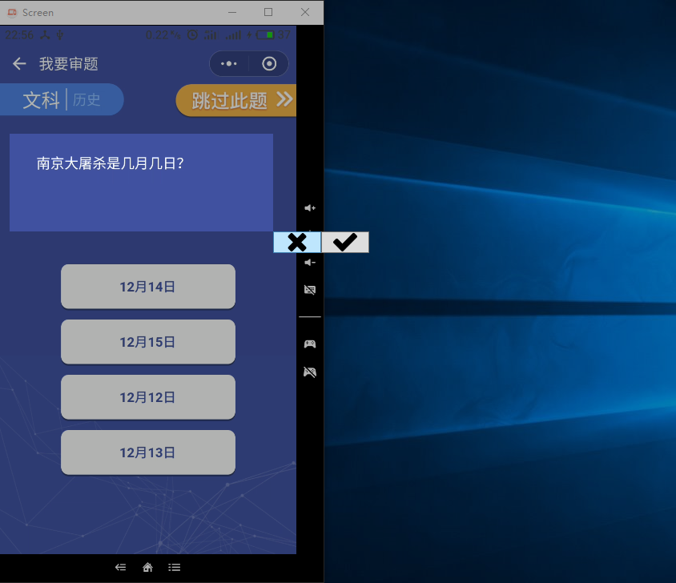
2. 点击**搜索**，OCR识别百度搜索一气呵成
    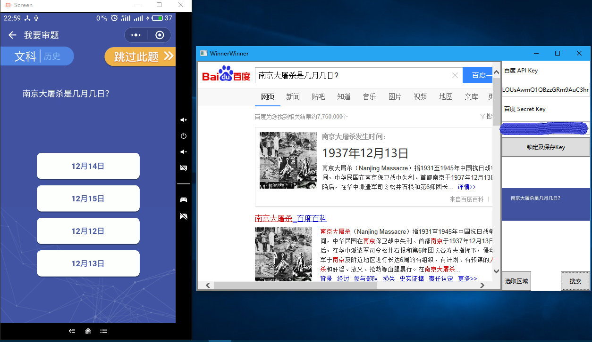